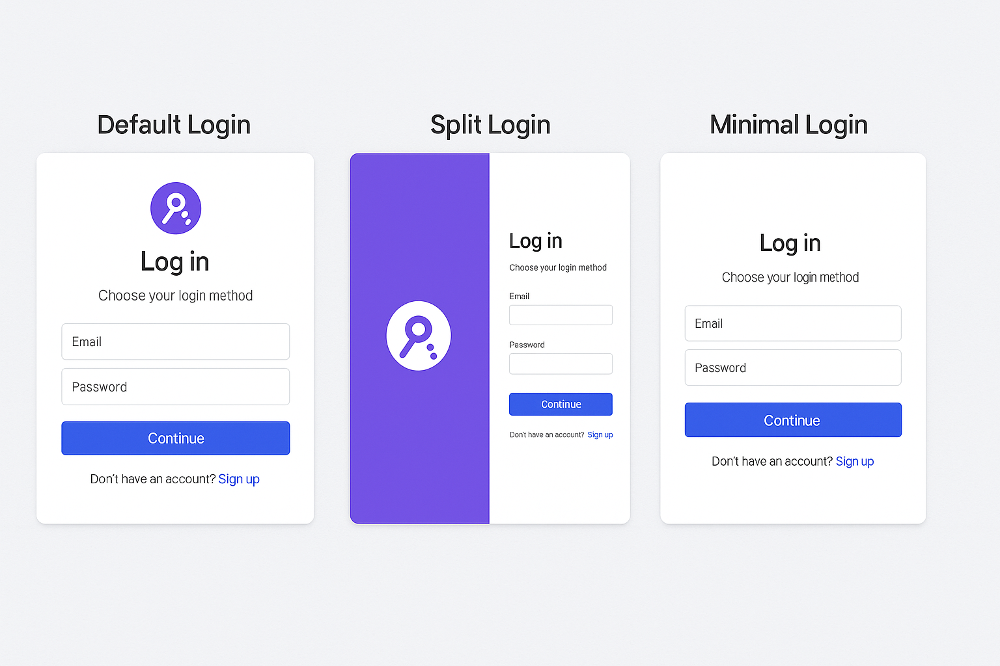

# Keycloak Nuxt Pro

**Keycloak + PKCE para Nuxt 4** com endpoints prontos (`/api/auth/*`), cookies HttpOnly, composable, middleware global e templates de login Pro prontos a usar.



<p align="center">
  
  
  
  
</p>

---

## Why Keycloak Nuxt Pro?

- 🔐 **PKCE + HttpOnly cookies** – fluxo OAuth2/OIDC seguro, sem tokens expostos no client.
- 🧠 **SSR-aware** – composable e middleware funcionam tanto em server como em client.
- ⚙️ **Endpoints prontos** – `/api/auth/login`, `/api/auth/callback`, `/api/auth/session`, `/api/auth/refresh`, `/api/auth/logout`.
- 🧩 **Composable único** – `useKeycloak()` para login, logout, refresh, sessão, licença, etc.
- 🛡 **Licenciamento offline (Ed25519)** – licença Pro verificada localmente, sem chamadas de rede.
- 🎨 **Templates de login Pro** – presets `default`, `split` e `minimal` focados em conversão.
- 🧰 **DX forte** – tipos TypeScript, validação de runtimeConfig, `debug` opcional, mensagens de erro claras.
- 🧪 **Playground incluído** – projeto de exemplo para testar o fluxo completo localmente.

---

## Plans

> O módulo é distribuído como **pacote privado** via GitHub Packages, com licenciamento **vitalício offline** (Ed25519).

| Plan     | Features principais                                         | License        | Support      |
|----------|-------------------------------------------------------------|----------------|--------------|
| **Community** | PKCE, SSR, endpoints básicos, login simples                 | 1 project      | None         |
| **Pro**       | Templates Pro, licença Ed25519, DX extra, updates incluídos | Lifetime (per project) | Priority email |
| **Agency**    | Uso em múltiplos clientes / domínios                      | Lifetime (multi-project) | Priority + onboarding |

> Este repositório/documentação focam no **Keycloak Nuxt Pro (Pro/Agency)**.

---

## Installation (GitHub Packages – private)

O pacote é publicado como:

```txt
@caminatenarang/keycloak-nuxt-pro
